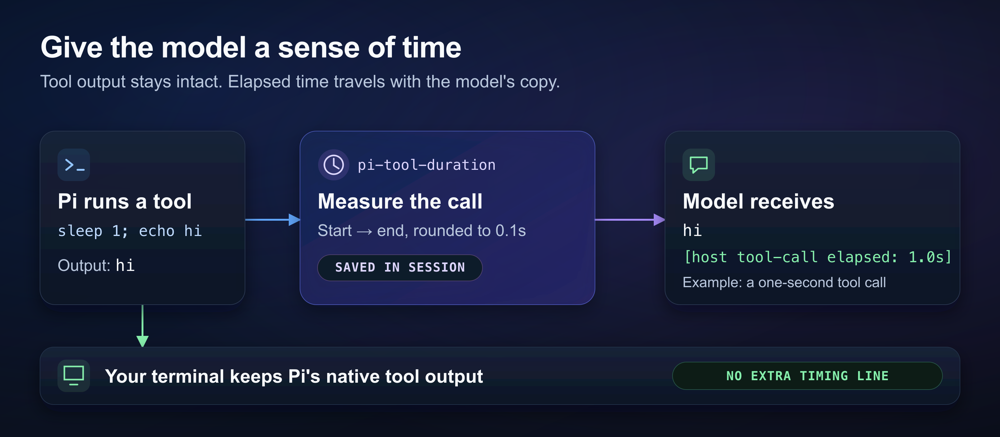

# pi-tool-duration

Let your Pi model see how long its tools took. This extension adds elapsed time to the tool results sent to the model while keeping Pi's terminal output unchanged, giving the model useful context when a command is slow or fails.



*Pi measures each call, saves the timing in the session, and adds it only to the copy the model receives.*

## Install

Requires **Pi 1.0.0+** and **Node.js 24+**. Tested with official Pi and the maintained [`fitchmultz/pi` fork](https://github.com/fitchmultz/pi).

```bash
pi install npm:pi-tool-duration
pi
```

Already running Pi? Use `/reload` to load the extension. You can also [install from Git or try a local checkout](docs/development.md#local-setup).

Next: [try a timed call](#try-it), [adjust the threshold](#configure), or read the [timing reference](docs/reference.md).

## Try it

Ask Pi:

```text
Use bash to run: sleep 1; echo hi
```

The tool result sent to the model looks like this (the measured time can vary):

```text
hi
[host tool-call elapsed: 1.0s]
```

You still see Pi's native tool rendering in the terminal. The extension adds no extra timing line there.

By default, successful calls taking **50 ms or more** get a marker. Faster successful calls stay unchanged because they would round to `0.0s`. Failed calls get a marker regardless of the threshold, when Pi observed their start and end.

## Configure

Set a threshold when starting Pi:

```bash
# Include even instant calls.
PI_TOOL_DURATION_THRESHOLD_MS=0 pi

# Include successful calls taking at least a second, plus failed calls.
PI_TOOL_DURATION_THRESHOLD_MS=1000 pi

# A valid CLI value overrides the environment variable.
pi --tool-duration-threshold-ms 500
```

Values are non-negative milliseconds. An invalid CLI value falls back to the environment variable; an invalid environment value falls back to **50 ms**. A missing timing record does not mean the call took zero seconds.

## How it works

The extension measures each call from Pi's execution-start event to its execution-end event with a monotonic clock, then rounds to tenths of a second. Timing is saved separately from the tool result and added to model-request copies, leaving recorded text, details, and images intact.

A few things to keep in mind:

- Timing includes preflight and result processing. Parallel calls can overlap, so adding their durations does not give total task time.
- A tool that starts a background job is timed through the launch call, not the job's whole lifetime.
- Saved timings survive reload, resume, forks, branch navigation, and retained compaction history. A generated summary may leave out individual timings.
- Built-in and extension tools with Pi execution events are covered. Direct `!` / `!!` commands and RPC `bash` messages are outside this scope.

See the [timing reference](docs/reference.md) for parallel-call details, history matching, compaction, and OpenAI Responses setup.

## More

- [Development and compatibility checks](docs/development.md)
- [Maintainer release procedure](docs/development.md#automatic-npm-releases)
- [Changelog](CHANGELOG.md)
- [Report a problem](https://github.com/fitchmultz/pi-tool-duration/issues)

## License

[MIT](LICENSE) · Mitch Fultz
